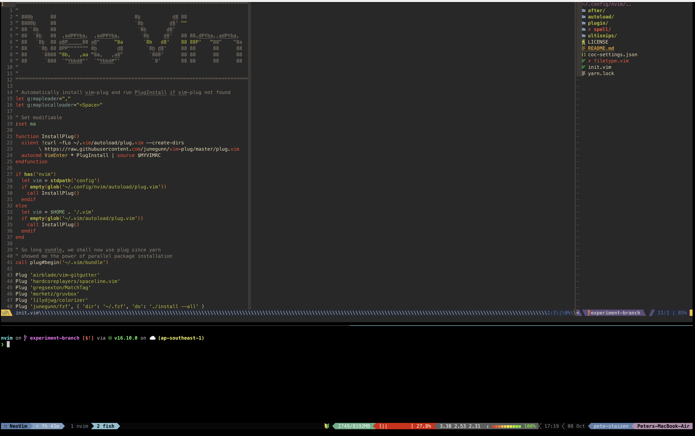

Collection of helpful tool configurations that I used on my day by day coding ⌨️



# Supported Versions

This configuration suite is validated and maintained for the following software baselines:

* **Fish Shell:** `v4.7.1` or higher
* **Kitty Terminal:** `v0.46.2` or higher

# Installation

Clone repository `git clone git@github.com:redjoker011/dotfiles.git`

## Pre-requisites

### Nerd Font

Install FiraCode Nerd Font from [here](https://www.nerdfonts.com/font-downloads)

source: https://github.com/huytd/haskplex-font

### Fish

Please follow this official [guide](https://github.com/fish-shell/fish-shell#getting-fish) on installing Fish on your respective platforms. (Requires Fish v3.0+)

Then create a symlink for `dotfiles/.config/fish` on your `.config` directory

```bash
cd dotfiles
ln -s .config/fish $HOME/.config
```

### Plugin Manager

Install fisher as plugin manager

```bash
curl -sL https://raw.githubusercontent.com/jorgebucaran/fisher/main/functions/fisher.fish | source && fisher install jorgebucaran/fisher
```

#### Install all required plugins using fisher update

### Plugins

- fisher - Fish Plugin Manager
- nvm.fish - Pure-fish Node.js version manager (Replaces slow bass wrappers)
- eza - Modern, maintained replacement for ls and exa
- ghq - Repository Manager like Go Get
- fzf.fish - Feature-rich fuzzy finder integration for Fish
- done - Desktop notifications for long-running commands
- autopair.fish - Auto-close brackets and quotes in terminal
- sponge - Keeps typos out of shell history
- puffer-fish - Smart text expansion (e.g., ... to ../.. and !!)

**Note:** The following external dependencies are required for fzf.fish to work with full syntax highlighting and diff previews. Please click on each item to view its installation guide:

- fzf - Command Line Fuzzy Finder
- fd - Fast replacement for find
- bat - Cat clone with syntax highlighting
- delta - Syntax-highlighting pager for git diffs

**Note:** Check this guide on how to make fish your default shell

TLDR;
- Add the line /usr/local/bin/fish to /etc/shells.
- Change your default shell with chsh -s /usr/local/bin/fish.
- Note: Brew installs fish on /opt/homebrew/bin/fish so you might need to
- symlink it on /usr/local/bin for it to work. e.g `sudo ln -s /opt/homebrew/bin/fish /usr/local/bin`
